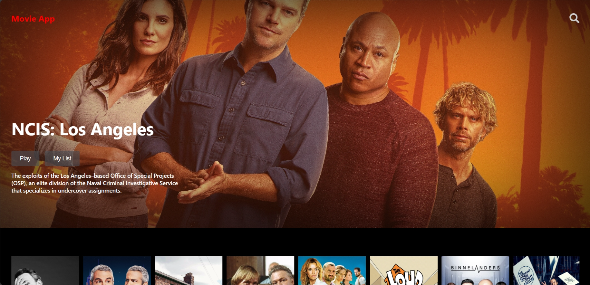

# MOVIE WEBSITE FRONTEND



## Introduction

Movie App, an unlimited entertainment experience, opens your doors to the diverse world of movies and TV shows. With a rich and ever-expanding library, Movie App brings to its audiences not only top movies and series from around the world, but also unique exclusive content that you can only experience at This.

## Tech Stack

-   ReactJS
-   React-Youtube
-   Axios
-   SCSS
-   Swiper
-   Vite

## Features

👉 Home Page: Dynamic home page showcases.

👉 Popup Style: Display detailed films information.

👉 Search Page: Name-based on-demand search.

👉 Responsive: Full responsiveness across devices for consistent user experience; fluid design adapts seamlessly to various screen sizes, ensuring accessibility.

## Quick Start

Follow these steps to set up the project locally on your machine.

**Prerequisites**

Make sure you have the following installed on your machine:

-   Git
-   Node.js
-   npm (Node Package Manager)

**Installation**

Install the project dependencies using npm:

```javascript
yarn;
```

**Running the Project**

```javascript
yarn dev
```
